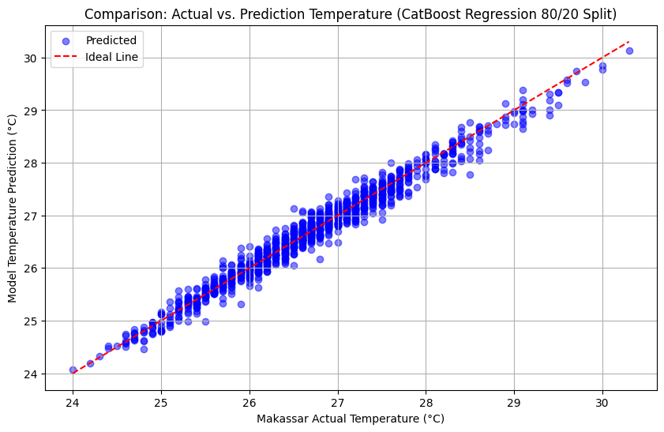
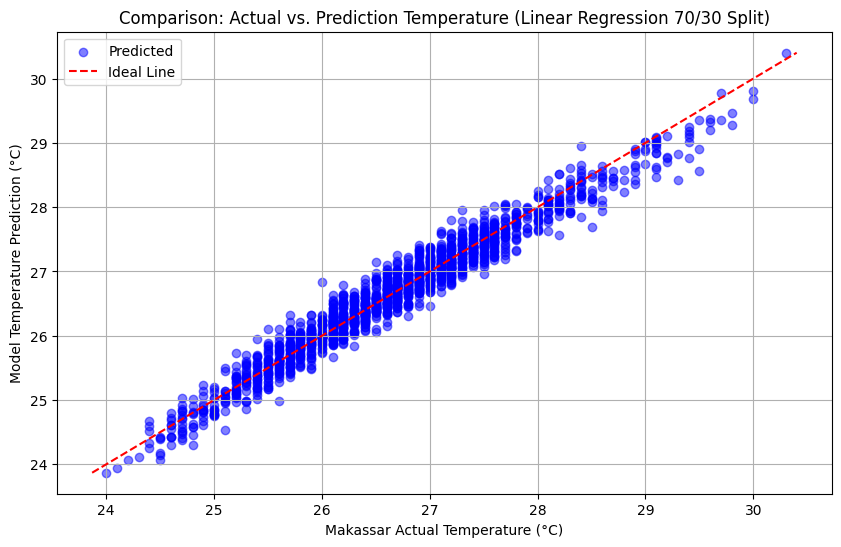

# Comparative Regression Analysis: Makassar Weather Prediction


## Project Overview
This project focuses on predicting weather conditions (specifically temperature) in Makassar, Indonesia, using various Machine Learning regression algorithms. The primary goal is to perform a comprehensive comparative analysis across multiple models and evaluate how different data splitting strategies (70:30 vs. 80:20) affect predictive performance.

## Repository Structure
The repository is organized cleanly to separate data, source code, and outputs:

*   `dataset/`: Contains the raw and processed weather datasets sourced from OpenMeteo.
*   `notebooks/`: Jupyter Notebooks containing the data preprocessing, exploratory data analysis (EDA), model training, and evaluation codes.
*   `images/`: Contains all output visualizations, neatly categorized into `7030_data_split/` and `8020_data_split/` folders for Actual vs. Predicted scatter plots.

## Dataset
*   **Source:** OpenMeteo Historical Weather API
*   **Location:** Makassar, South Sulawesi, Indonesia
*   **Target Variable:** Temperature (°C)
*   **Features:** Temperature Max, Sunshine Duration, Precipitation Sum, Apparent Temperature, Wind Speed Max, Shortwave Radiation Sum, Weather Code, Temperature Min

## Data Preprocessing & Setup
Before feeding the data into the machine learning models, the following preprocessing steps were executed:
* **Data Formatting:** Converted the raw dataset from Excel (`.xlsx`) to CSV format for better compatibility and faster loading.
* **Feature Selection:** The `time` column was dropped as standard regression models require numerical inputs, leaving only meteorological numerical features.
* **Target Isolation:** The `temperature_2m_mean` was isolated as the target variable (`y`), while the rest served as the input features (`X`).
* **Data Splitting:** The dataset was strictly split into training and testing sets using Scikit-Learn's `train_test_split` with a fixed `random_state=1` to ensure absolute reproducibility during the 70:30 and 80:20 evaluation phases.

## Models Evaluated
We trained and evaluated several algorithms to find the most optimal model for this specific time-series/regression task. The models include:
*   CatBoost Regression
*   XGBoost Regression
*   LightGBM Regression
*   Gradient Boosting
*   AdaBoost Regression
*   Support Vector Regression (SVR - Linear, Polynomial, RBF)
*   Linear Regression

**Evaluation Metrics:** Root Mean Squared Error (RMSE), Mean Absolute Error (MAE), and R-Squared (R²).

## Results & Highlights

### The Best Performing Model
After rigorously testing the models across two data split ratios, **CatBoost Regression** using the **80:20** split ratio emerged as the most accurate predictor. 

> *With an MAE of 0.1265, the model's predictions deviate by an average of only ~0.13°C from the actual temperature, demonstrating strong reliability. Its extremely low RMSE of 0.1645 further indicates that the model rarely makes extreme prediction errors.*

### Visual Comparison: Best vs. Baseline
Below is the visualization of the model's performance. The blue points represent the predicted temperatures against the actual temperatures, while the red dashed line represents the ideal perfect prediction.

| Best Model: CatBoost Regression (80:20) | Baseline Model: Linear Regression (70:30) |
| :---: | :---: |
|  |  |
| *Better high density along the ideal line indicates superior accuracy and minimal variance.* | *Shows wider dispersion, indicating struggle with capturing the non-linear weather fluctuations.* |

*(Note: Full visualization plots for all 14 model variations can be found in the `images/` directory).*

## Key Takeaways
1. **Accuracy vs. Time Trade-off:** While CatBoost delivered the absolute best accuracy (R² = 0.9714), it required the longest training time (~2.33s). For scenarios demanding faster execution, **SVR RBF** and **LightGBM** offer excellent compromises—LightGBM trains in just 0.19s while still maintaining a highly accurate R² of 0.9680.
2. **The Underperformers:** SVR Polynomial and AdaBoost performed the poorest across all tests (R² dropping to 0.83 and 0.92, respectively). Their high MAE and RMSE values indicate a significantly wider spread of inaccurate predictions.
3. **Data Split Impact:** Shifting from a 70:30 to an 80:20 split caused minor fluctuations. Models like XGBoost, CatBoost, and SVR RBF saw a slight increase in accuracy by learning from a larger historical context, whereas linear models experienced a negligible drop. Regardless of the split, CatBoost consistently secured the top spot.
4. **Data Limitations & Future Scope:** The dataset relies strictly on meteorological parameters from Open-Meteo without external macro-climate or local urban heat indicators. Additionally, the baseline numerical data was fed directly into the models without explicit feature scaling (e.g., `StandardScaler`). While tree-based models like CatBoost handled this perfectly, distance-based models like SVR (particularly SVR Polynomial) suffered in accuracy. Future iterations will incorporate feature scaling to fully unlock the potential of the SVR models.

## How to Run (Local / VS Code)

To reproduce this analysis locally, follow these steps:

1. **Clone the repository:**
   ```bash
   git clone https://github.com/Payama01/comparative-regression-weather-makassar.git
   cd comparative-regression-weather-makassar
2. **Install dependencies:** \
Make sure you have Python installed, then run the following command in your terminal to install all required libraries:
   ```bash
   pip install -r requirements.txt
4. **Run the Analysis:**
*  Open the comparative-regression-weather-makassar folder in Visual Studio Code.
*  Ensure you have the official Jupyter extension installed in VS Code.
*  Navigate to the notebooks/ directory and open the .ipynb file.
*  Select your Python environment (Kernel) in the top right corner of VS Code.
*  Click Run All to execute the cells and reproduce the analysis.
## Author
**Payama (Muhammad Yusuf Erki)**
*   Information Technology Undergraduate at Universitas Tarumanagara (UNTAR)
*   [[LinkedIn]](https://www.linkedin.com/in/muhammad-yusuf-erki-78495b306/)
*   [[Github]](https://github.com/Payama01)

## 📜 License
This project is licensed under the MIT License - see the [LICENSE](LICENSE) file for details.
*(Feel free to use the code and datasets for your own learning or research purposes).*
